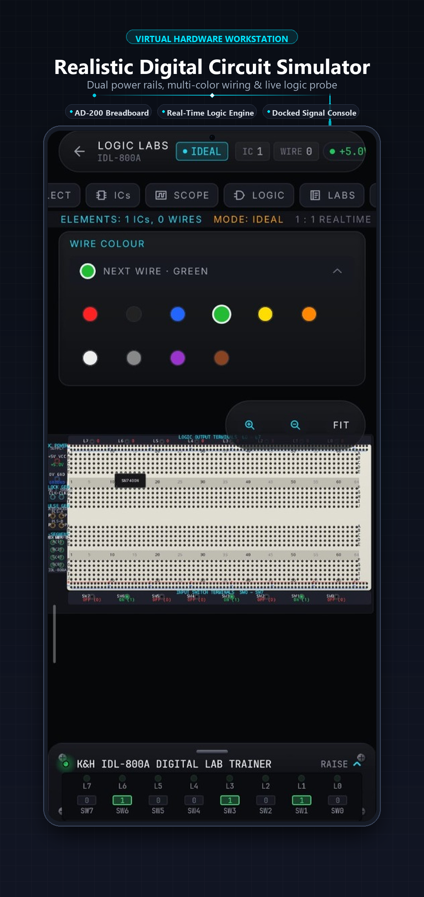
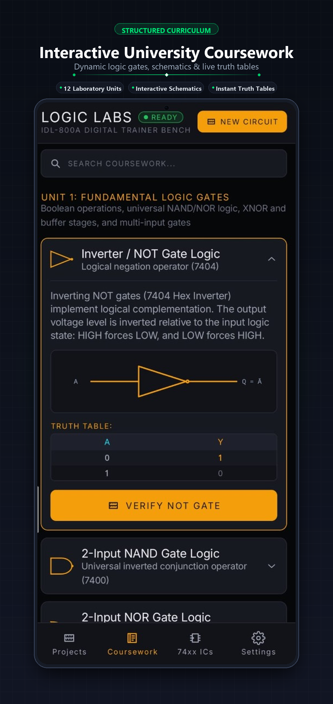
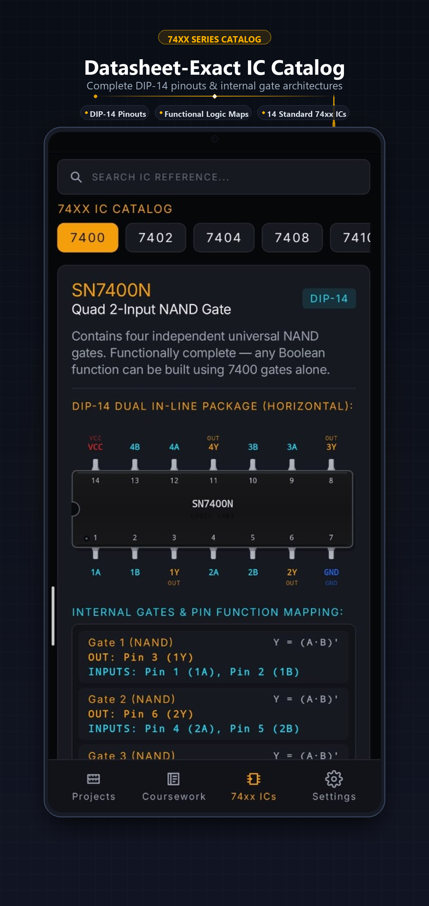
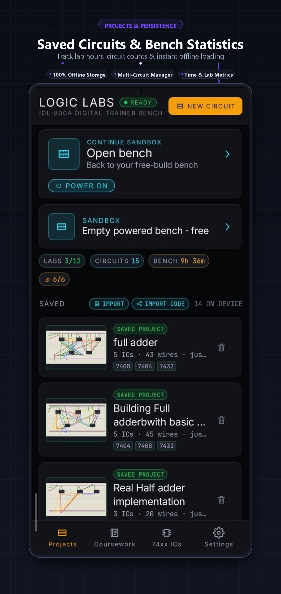
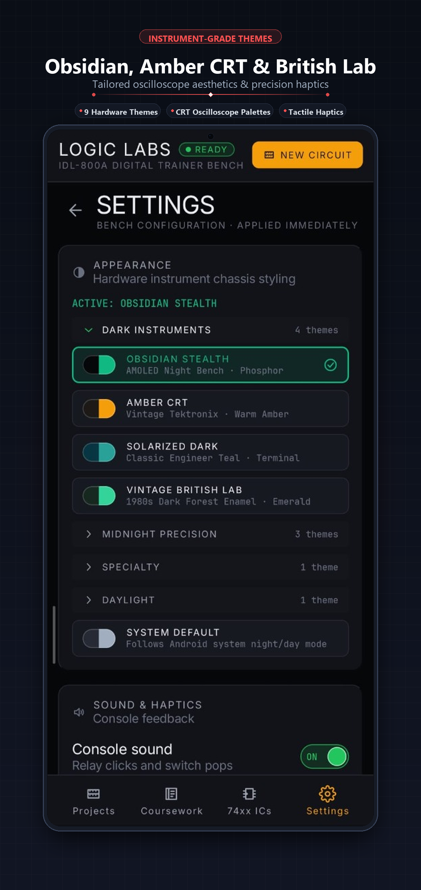

<div align="center">

# ⚡ Logic Labs
### The Professional Digital Electronics Laboratory in Your Pocket.

**A faithful, fully offline digital twin of the legendary K&H IDL-800A Digital Lab Trainer.**  
Place datasheet-exact 74xx TTL integrated circuits onto a true-to-topology AD-200 breadboard, wire them with sagging 2.5D jumpers, drive them with authentic trainer instruments, and verify circuits with an automated truth-table engine.

[](https://github.com/AdnanFoisal/LogicLabs/releases)
[](https://kotlinlang.org)
[](https://developer.android.com/jetpack/compose)
[](LICENSE)
[](https://developer.android.com)
[](README.md#-zero-compromise-privacy--architecture)

</div>

---

## 📸 The App in Action

<div align="center">

| ⚡ Virtual Workstation | 🎓 Guided Coursework | 📖 74xx IC Catalog | 💾 Projects & Persistence | 🎨 Instrument Themes |
| :---: | :---: | :---: | :---: | :---: |
|  |  |  |  |  |
| *AD-200 breadboard, 8-colour wiring & real-time simulation* | *12 university lab units with dynamic truth tables* | *Datasheet-exact DIP-14 pinouts & gate schematics* | *Circuit manager, offline storage & lab time metrics* | *Obsidian Stealth, Amber CRT & tactile feedback* |

</div>

> *"No accounts. No network requests. No telemetry. Just pure, unadulterated digital logic."*

---

## 🌟 Why Logic Labs?

Most electronics apps rely on abstract 2D schematic diagrams. **Logic Labs bridges the gap between theoretical schematics and real physical hardware**, simulating the real layout, pinouts, and electrical properties of university digital-logic training consoles.

```
       [ K&H IDL-800A TRAINER CONSOLE ]
 ┌──────────────────────────────────────────────┐
 │  [SW0-SW7]   [PULSERS]   [CLOCK]   [7-SEG]   │
 └──────┬──────────┬───────────┬─────────┬──────┘
        │          │           │         │
 ┌──────▼──────────▼───────────▼─────────▼──────┐
 │       AD-200 TRUE-TOPOLOGY BREADBOARD        │
 │   1,896 Tie-Points • 7 Rails • Center Trench │
 │    7400   7404   7408   7432   7483   7474   │
 └──────────────────────┬───────────────────────┘
                        │
 ┌──────────────────────▼───────────────────────┐
 │     DIAGNOSTICS & VERIFICATION ENGINE        │
 │  Dual-Trace Scope • Gate Schematic • PDF Cert│
 └──────────────────────────────────────────────┘
```

---

## 🔬 Core Features

### 🧩 1. True-to-Topology 2.5D Breadboard (AD-200)
* **1,896 Physical Tie-Points:** Four 64-column terminal blocks (rows A–E and F–J), seven distribution power rails (+ and − buses), and a standard 0.3″ DIP central trench.
* **Physics-Based Jumper Wires:** Wires have realistic 2.5D curvature, weight sag, and elevation layering. Connect via fluid drag-and-drop or precision tap-to-connect.
* **Magnetic Snapping & 2.2× Loupe:** Floating magnification loupe ensures pinpoint socket targeting without finger occlusion.
* **10 Insulation Colors:** Color-code circuits using standard industry wire colors (Red, Black, Blue, Green, Yellow, White, Orange, Purple, Gray, Brown).
* **Electrical Safety & PRACTICAL Mode:** Toggle between forgiving educational mode and **PRACTICAL mode**—where reverse polarity or short-circuit bus contention burns out chips with audible and visual feedback.

### 🔌 2. Datasheet-Exact 74xx TTL Integrated Circuits
Every IC is simulated down to the gate level with accurate pin assignments, propagation characteristics, and pin-1 orientation notches:

| Part # | Family / Package | Description |
| :---: | :--- | :--- |
| **7400** | Quad 2-Input | NAND Gates (Universal Gate) |
| **7402** | Quad 2-Input | NOR Gates (Universal Gate) |
| **7404** | Hex Inverters | NOT Gates |
| **7408** | Quad 2-Input | AND Gates |
| **7410** | Triple 3-Input | NAND Gates |
| **7411** | Triple 3-Input | AND Gates |
| **7420** | Dual 4-Input | High Fan-in NAND Gates |
| **7432** | Quad 2-Input | OR Gates |
| **7448** | BCD Decoder | 7-Segment Active-High Display Driver |
| **7474** | Dual D-Type | Positive-Edge-Triggered Flip-Flops with Preset & Clear |
| **7476** | Dual J-K | Master-Slave Flip-Flops with Preset & Clear |
| **7483** | 4-Bit Arithmetic | Binary Full Adder with Fast Lookahead Carry |
| **7486** | Quad 2-Input | Exclusive-OR (XOR) Gates |
| **74266**| Quad 2-Input | Open-Collector Exclusive-NOR (XNOR) Gates |

*Tap any placed chip on the bench to open its live pinout diagram and truth table.*

---

### 🎛️ 3. The IDL-800A Hardware Trainer Console
A complete physical instrumentation console built right alongside the breadboard:
* **8 Data Switches (SW0–SW7):** Heavy-duty SPDT rocker switches with mechanical throw animation and persistent binary outputs.
* **2 Debounced Pulsers:** Momentary switches generating clean, single-cycle positive and negative pulses with complementary \(Q\) and \(\bar{Q}\) outputs.
* **8 Buffered LED Monitors:** High-contrast logic indicators simulating optical persistence-of-vision and phosphor decay.
* **Detented Clock Generator:** Stepped hardware clock selectable from **0.5 Hz, 1 Hz, 2 Hz, 5 Hz, 10 Hz, 100 Hz, 1 kHz, 10 kHz, to 100 kHz**, plus manual single-stepping.
* **Dual 7-Segment Displays:** Common-cathode LED numeric readouts driven directly by binary/BCD inputs.
* **Master Power Rocker:** Bench-wide VCC and GND distribution master switch.

---

### 📈 4. Diagnostic & Analysis Instruments

#### 🔍 Real-Time Dual-Channel Oscilloscope
* Attach Channel 1 and Channel 2 probes to any breadboard socket or console signal.
* Switch between **CH1, CH2, and DUAL** sweep modes.
* Adjust timebase (ms/DIV) and vertical volts-per-division to observe clock divisions, ripple delays, and flip-flop state transitions.

#### 🗺️ Live Boolean Schematic Synthesizer
* Flips your physical wiring into a **standardized gate-level schematic** in real time.
* Live signal color-coding: **Green = HIGH**, **Gray = LOW**, **Red = Bus Contention**.
* Displays automatically derived algebraic Boolean expressions for every active circuit output.

---

### 🎓 5. Coursework & Dynamic Verifier Engine

Comprehensive university laboratory curriculum spanning introductory gate logic to complex sequential machines:

| Core Curriculum Labs | Advanced Extended Experiments |
| :--- | :--- |
| **Lab 1:** Basic Logic Gates & Truth Tables | **Converter:** 4-Bit Binary-to-Gray & Gray-to-Binary |
| **Lab 2:** Universal NAND/NOR Gate Synthesis | **Arithmetic:** 2-Bit & 4-Bit Magnitude Comparators |
| **Lab 3:** Half Adder & Full Adder Arithmetic | **Routing:** 3-to-8 Decoders & 4:1 Multiplexers / Demux |
| **Lab 4:** BCD Decoders & Seven-Segment Displays | **Sequential:** Up/Down Ripple Counters & Divide-by-N |
| **Lab 5:** Latches, Flip-Flops & State Memory | **Mixed-Signal:** 4-Bit Weighted-Resistor D/A Converter |

* **Dynamic Lab Matching:** The bench verifier continuously inspects your wiring and automatically identifies matching lab experiments.
* **Automated Truth-Table Verification:** Sweeps the full \(2^N\) input vector space in milliseconds to validate circuit correctness.
* **A4 PDF Lab Reports:** Export official, printable PDF lab certificates containing circuit schematics, test bench results, timestamps, and an HMAC-SHA256 verification seal.

---

### 🎨 6. Sensory Engineering & Nine Hardware Themes
Customize your workbench to match your favorite lab environment:
* 🖤 **Obsidian:** Deep true-black palette optimized for AMOLED screens.
* 🧡 **Amber CRT:** Warm vintage 1980s monochromatic phosphor glow.
* 🪨 **HP Slate:** Classic Hewlett-Packard test-bench industrial gray.
* 📄 **Cleanroom:** High-contrast, paper-white daylight lab theme.
* 💜 **Cyberpunk Neon:** Electric violet and cyan retro-futurism.
* 🌌 **Tokyo Night:** Modern deep-indigo developer palette.
* 🌊 **Solarized Dark:** Low-contrast precision palette.
* 🏛️ **Vintage British Lab:** Classic brass and heritage instrumentation finish.
* ❄️ **Titanium Frost:** Crisp brushed-metal aerospace styling.
* 🔊 **Zero-Asset Audio:** Mechanical switch snaps, pulser thumps, and relay clicks synthesized at runtime via Android `AudioTrack`—zero audio files bundled.
* 📳 **Haptic Feedback:** Dynamic tactile responses calibrated for switch throws and socket connections.

---

### 🛡️ 7. Zero-Compromise Privacy & Architecture
* **100% Offline by Design:** Logic Labs does not declare `android.permission.INTERNET`. It cannot connect to the internet, make API calls, or transmit telemetry.
* **Zero Tracking / Zero Ads:** No Google Play Services, no Firebase, no crash reporting, no ad SDKs, no trackers.
* **Local-First Storage:** Circuits, coursework progress, and preferences reside solely on your device.
* **JSON Project Import / Export:** Share circuits with classmates or professors using plain, human-readable JSON files.

---

## 🛠️ Architecture & Tech Stack

Logic Labs uses a modular Gradle architecture designed for fast compilation, maintainability, and reproducibility:

```
                      ┌────────────────┐
                      │      :app      │ (Shell, Navigation, UI Orchestration)
                      └──┬────┬────┬───┘
                         │    │    │
       ┌─────────────────┘    │    └─────────────────┐
       ▼                      ▼                      ▼
┌──────────────┐    ┌─────────────────┐    ┌─────────────────┐
│:feature-tools│    │:feature-instrmts│    │:feature-brdbord │
│(Verifier,    │    │(Console, Gauges,│    │(Canvas, Loupe,  │
│ Scope, Labs) │    │ Clock, Displays)│    │ Jumper Physics) │
└──────┬───────┘    └────────┬────────┘    └────────┬────────┘
       │                     │                      │
       └────────────────┐    │    ┌─────────────────┘
                        ▼    ▼    ▼
                    ┌─────────────────┐
                    │  :core-bridge   │ (Netlist DSU, 74xx Catalog)
                    └────────┬────────┘
                             │
                             ▼
                    ┌─────────────────┐
                    │  :core-digital  │ (Headless Simulation Engine)
                    └─────────────────┘
```

### Module Responsibilities
| Module | Purpose |
| :--- | :--- |
| `:app` | Application shell, navigation, theme provider, and dialog orchestration |
| `:core-digital` | Event-driven logic simulation primitives derived from `hneemann/Digital` (pure JVM) |
| `:core-bridge` | Circuit netlist, Disjoint-Set Union (DSU) graph solver, 74xx TTL catalog |
| `:core-data` | DataStore preferences, project JSON serializer, and autosave management |
| `:core-designsystem` | Nine hardware themes, typography, component tokens, and vector icons |
| `:feature-breadboard` | 2.5D breadboard Canvas painters, Bezier geometry, gesture handlers, loupe |
| `:feature-instruments` | IDL-800A trainer console controls, rocker switches, pulsers, clock, displays |
| `:feature-tools` | Dual-trace oscilloscope, boolean schematic generator, coursework, PDF exporter |
| `:core-testing` | Multi-tier automated verification suites and testing harnesses |

---

## 🚀 Building from Source

### Prerequisites
* **JDK 17** (e.g. OpenJDK 17, Eclipse Temurin)
* **Android SDK** with Platform `android-35` installed
* `local.properties` with `sdk.dir` pointing to your Android SDK

```bash
# 1. Clone the repository
git clone https://github.com/AdnanFoisal/LogicLabs.git
cd LogicLabs

# 2. Run unit test suites across all modules
./gradlew test

# 3. Build debug APK
./gradlew :app:assembleDebug

# 4. Build official unsigned R8 release APK
./gradlew :app:assembleRelease
```

The resulting release APK will be generated at:
```
app/build/outputs/apk/release/app-release-unsigned.apk
```

---

## ⭐ Star & Support the Project

If you find Logic Labs useful for your coursework, lab experiments, teaching, or hobby projects, **please star this repository** on GitHub! It helps more students, professors, and open-source engineers discover this free hardware simulation suite.

<div align="center">

[](https://github.com/AdnanFoisal/LogicLabs)
[](https://github.com/AdnanFoisal/LogicLabs/fork)

</div>

---

## 🤝 Contributing

Contributions are warmly welcomed from electrical engineering students, university professors, lab instructors, and Android developers!

### How You Can Help
* 🐛 **Report Bugs & Simulation Edge-Cases:** Found an unexpected behavior in gate propagation, timing, or breadboard snapping? [Open an Issue](https://github.com/AdnanFoisal/LogicLabs/issues) with reproduction steps.
* 🧩 **Implement New 74xx TTL ICs:** Want to add your favorite chip (e.g. `74138` 3-to-8 decoder, `74151` 8-to-1 MUX, `74161` synchronous counter, or `74193` up/down counter)? Check out `:core-bridge` and open a Pull Request!
* 🎓 **Contribute Coursework Experiments:** Propose and design new laboratory experiments, interactive truth-table verification challenges, or preset circuits.
* 💡 **UI/UX & Design:** Ideas for enhanced gestures, accessibility improvements, or new hardware console themes are always appreciated.

### Contributing Workflow
1. Fork the repository and create your feature branch:
   ```bash
   git checkout -b feature/my-new-74xx-chip
   ```
2. Make your changes and run the full test suite locally:
   ```bash
   ./gradlew test
   ```
3. Commit with concise, descriptive commit messages.
4. Submit a Pull Request describing your additions!

---

## 📜 License & Acknowledgements

* **Application License:** [GNU General Public License v3.0 (GPL-3.0-only)](LICENSE). The combined application binary is distributed under GPL-3.0-only due to the inclusion of `:core-digital` (hneemann/Digital, which is licensed under GPL-3.0 without the "or later" clause). Original Logic Labs source code outside `:core-digital` remains available under GPL-3.0-or-later.
* **Simulation Core:** The digital simulation engine in `:core-digital` is derived from the open-source project **[hneemann/Digital](https://github.com/hneemann/Digital)** (GPLv3), which governs the distribution of the combined application binary.
* **Fonts:** Bundled typography ([Inter](https://github.com/rsms/inter) by Rasmus Andersson and [JetBrains Mono](https://github.com/JetBrains/JetBrainsMono) by JetBrains) is licensed under the [SIL Open Font License 1.1](THIRD_PARTY_NOTICES.md).
* See [`THIRD_PARTY_NOTICES.md`](THIRD_PARTY_NOTICES.md) for complete attribution and license texts.

---

<div align="center">

**Crafted with precision for students, makers, and digital logic enthusiasts.**

[](https://github.com/AdnanFoisal/LogicLabs)
[](https://github.com/AdnanFoisal/LogicLabs/fork)

</div>
